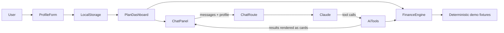

# Nurture

A warm savings coach. Set a near-term plan, watch it come together, and see what a spend does to the arrival date. The UK priority ladder still lives on Money health.

Load Jordyn or Jordan from the splash screen, or plan a new goal. Demo moments (a night out, payday, a missed save) sit on the Moments button. Numbers come from the calculators. The coach explains them and does not invent maths.

## Hackathon demo scope

Nurture is deliberately a **local-first demo**. Bank accounts, transactions, email/calendar signals, product rates and personas are deterministic fixtures; they are visibly labelled as sample connections in the flow and never leave the browser. This makes the full journey reliable to demonstrate without credentials, consent flows or a database.

The optional live integration is the conversational coach. With an Anthropic key it uses Claude; without one it serves a deterministic scripted response, so the demo remains complete offline.

## Money health

The earlier guide answered "What should I do with my next £?" across **debt, savings, ISAs, current accounts, a pension match and a mortgage**. That engine is unchanged and available at `/money-health` (`/plan` redirects there).

- A deterministic **rules engine** follows the widely used UK priority order and splits any amount step by step.
- A **chat guide** explains trade-offs and runs what-ifs. It never does its own maths: every figure comes from
  the same calculators as the dashboard, called as tools and shown as cards. With `ANTHROPIC_API_KEY` that guide is
  Claude. Without a key, the same screen uses a scripted reply so the demo still runs.
- Everything is stored in the browser (`localStorage`). There is no database and no login.

> Guidance, not regulated financial advice. All providers and rates are fictional and illustrative.
> Tax rules are for England, Wales and Northern Ireland (2026/27).

## Quick start

Requires Node.js 22+.

```bash
npm install
cp .env.example .env.local   # then paste your key from https://console.anthropic.com
npm run dev                  # http://localhost:3000
```

The plan, milestones, Wrapped story and scripted chat all work without a key. Set `ANTHROPIC_API_KEY` to talk to
Claude instead of the scripted replies. You can set `ANTHROPIC_MODEL` to choose another Claude model (default
`claude-sonnet-4-5`).

### Optional natural Coach voice

Set `ELEVENLABS_API_KEY` to have Coach replies played through ElevenLabs instead of the browser's system voice.
The key is used only by `app/api/voice/route.ts` and is never sent to the browser. The route uses ElevenLabs'
low-latency `eleven_flash_v2_5` model and a single warm British Coach voice (Charlotte, now routed by ElevenLabs
to its British replacement Helen). Restart `npm run dev` after adding or changing the key so Next.js can load it.

| Script | What it does |
| --- | --- |
| `npm run dev` | Start the dev server |
| `npm test` | Run the Vitest suite (finance engine plus AI tool streaming) |
| `npm run lint` | ESLint |
| `npm run build` | Production build |

> **OneDrive tip:** this folder lives in OneDrive. Syncing `node_modules` makes installs slow and can cause
> file-lock errors. Pause sync while installing, or move the repo outside OneDrive.

## How it works



The chat route validates the profile with Zod and builds the tools *around* it, so Claude only supplies scenario
inputs (for example `amount: 500`) and can't misstate the user's own numbers.

### The priority ladder (`lib/finance/ladder.ts`)

1. **Essentials and minimum payments.** If outgoings exceed income, or payments have been missed, the plan
   stops and signposts free debt advice (MoneyHelper, StepChange, National Debtline, Citizens Advice).
2. **Starter buffer:** the greater of £1,000 or one month of outgoings, in the best instant-access home after tax.
3. **Employer pension match:** flagged as an action (costs nothing extra from this pot).
4. **High-interest debt** (8%+ APR, overdrafts included), highest rate first. Live 0% deals are skipped,
   with a warning showing the monthly amount needed to clear them before the promo ends.
5. **Emergency fund:** 3 to 6 months of outgoings, in a taxable easy-access account or a Cash ISA, whichever pays
   more after the user's marginal savings tax.
6. **Lifetime ISA** for first-time buyers aged 18 to 39 (property up to £450k), £4,000 a year with a 25% bonus.
7. **Other debt** where the APR beats the best after-tax savings rate. Student loans are always excluded.
8. **Mortgage overpayment vs saving**, within the yearly penalty-free allowance.
9. **Long-term saving:** Cash or Stocks & Shares ISA, or a pension top-up. No specific investment picks.

Alongside the ladder: **quick wins** (account fees, switching bonuses, expensive overdrafts, idle current-account
cash, tax on savings interest) and **mortgage tools** (overpay vs save at today's rate *and* at the best
remortgage rate if a deal ends within 6 months, plus a remortgage comparison against the standard variable rate).

### Project layout

```
app/
  page.tsx                 Landing, demo personas, onboarding form
  plan/page.tsx            Dashboard and chat panel
  api/chat/route.ts        Claude via AI SDK, with a deterministic fallback
components/
  profile-form.tsx, onboarding.tsx
  plan/                    Allocation, ladder, alerts, quick wins, debt chart, mortgage views
  chat/                    Chat panel, markdown, tool-result cards
lib/
  profile.ts               Zod schema and types
  use-profile.ts           localStorage-backed hook
  finance/                 tax.ts, savings.ts, debt.ts, mortgage.ts, ladder.ts (+ tests)
  ai/                      tools.ts, systemPrompt.ts (+ stream tests with a mock model)
data/
  products.ts              Fictional UK products, ratesAsOf
  personas.ts              Sam, Priya, Mark
```

## Demo script (about 4 minutes)

1. **Landing page:** "Most comparison sites look at one product at a time; this looks at your whole picture."
2. **Load Priya** (two cards, an overdraft, a loan, missing her employer match).
   - The £1,500 is split: top up the buffer, clear the 39.9% overdraft, then start on the 24.9% card.
   - Point out the **action** to raise her pension contribution and the **0% deal ending in 5 months** warning.
   - Scroll to the avalanche vs snowball chart.
   - In chat, ask *"Avalanche or snowball for my debts?"*. The answer arrives with a **Calculated** card.
   - Try a what-if: *"What if I put £1,200 a month towards them?"*
3. **Load Sam** (first-time buyer, 28). £5,000 goes to the buffer, then the emergency fund, then the **Lifetime ISA**
   with a 25% bonus. The student loan is deliberately left alone. Ask *"Is a Lifetime ISA right for my house deposit?"*
4. **Load Mark** (higher-rate taxpayer, mortgage at 2.09%, deal ends in 4 months).
   - £10,000 goes to a **tax-free Cash ISA**, because saving beats overpaying at 2.09%.
   - The overpay-vs-save card re-runs the comparison at the best remortgage rate, where it gets much closer.
   - Quick wins show the tax he's paying on savings interest.
   - Ask *"My deal ends soon. What are my options?"*
5. **Guardrails:** tell the guide *"I've missed my last two credit card payments"*. It switches to kind, free
   debt-advice signposting.

## Guardrails

- Numbers come only from tested, deterministic functions. The system prompt forbids Claude from inventing figures
  and requires it to quote the `ratesAsOf` date.
- Framed as guidance, not advice: no specific investment recommendations; complex topics are referred to
  regulated advisers or MoneyHelper's Pension Wise.
- Vulnerability handling: missed payments or negative budgets stop the plan and signpost free debt advice;
  the guide signposts Samaritans (116 123) if self-harm is mentioned.
- Privacy: the profile stays in the browser and is sent to the server (and Claude) only when the user chats.

## Ideas for next steps

Open Banking import for real transactions, live rate feeds, Scottish tax bands, a regular-saver optimiser,
mortgage affordability for first-time buyers, and saved plans with accounts.
