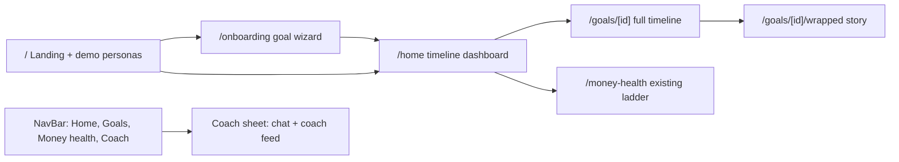

# Nuture Savings Timeline: Goals, Visualiser and Proactive Coach

## 1. Summary

The current MVP, branded NextPound, answers "What should I do with my next £?" for an older, debt/mortgage-heavy audience (`/` onboarding, `/plan` ladder dashboard, Grok chat with calculator tools, all in `localStorage`). This plan **renames the app to Nuture** and pivots the **home experience** to a goals-first **Savings Timeline** for younger, less financially literate savers. The existing ladder dashboard moves to a secondary **Money health** tab.

**Prerequisite:** the MVP source lives on branch `cursor/cursorandeffect-mvp`. `main` only contains the initial commit (a one-line README). Implementation must start from the MVP branch, either by creating a feature branch off it or by merging it into `main` first.

Core promise: *"Nuture: see your plans come together."* Progress feels close and visible. The future plan feels like "me". Small actions hit clear checkpoints. Spending is framed as delaying a named plan, not as failure. Money moves on autopilot.

Hackathon constraints:

- All accounts, transactions and email/social signals are mocked, with seeded fixtures plus a demo-controls drawer.
- Every number comes from pure, tested engine functions. Grok only explains and coaches, the same rule as today in [lib/ai/systemPrompt.ts](lib/ai/systemPrompt.ts).
- No DB and no auth. State stays in `localStorage`.
- Before writing route code, read the relevant guides in `node_modules/next/dist/docs/` (Next 16.3: async `params`, the `PageProps`/`LayoutProps` helpers, and `redirects` in `next.config.ts`), as required by [AGENTS.md](AGENTS.md).

## 2. Customer and problem

**Who:**

- Early-career people on lower incomes with little disposable income
- People planning to start a family
- People with near-term aspirations (trips, gigs, a car) as well as long-term ones (a home, family)
- People who are not financially literate and don't see the value of long-term saving

**Problem:**

- The only goals on offer (house deposit, retirement) feel unreachable, so "save more" has no meaning.
- Without visible near-term wins, people delay saving. That leads to missed goals and reliance on credit.
- Big spends (a big night out) aren't connected to what they displace, and nobody helps recover from them.

**Stance:** "Pause and choose", never "you're failing". The tone should be positive, recoverable and human.

## 3. Behavioural principles and the features that apply them

- **Goal gradient** (Kivetz 2006): the headline is *distance left* ("£640 · 41 days to Bali"), not £ saved.
- **Vivid progress near the end** (Cheema & Bagchi 2011): the visual intensity of the timeline scales with progress. Below 25%, show small-win checkpoints. From 25% to 75%, use the standard view. Above 75%, enlarge the plan photo and show a countdown and a glow.
- **Future-self continuity** (Hershfield): every goal has a photo, a date, a "why it matters" line and "Future you on 4 Sep 2027, aged 25".
- **Checkpoints as reference points** (Colby & Chapman 2013): checkpoints sit on exact multiples of the auto-save, so one realistic deposit hits a checkpoint exactly.
- **Opportunity cost made explicit** (Frederick 2009): every spend alert and the simulator show "+N days to [goal name]".
- **Earmarking and commitment** (Thaler; CFPB/Qapital 2022): each goal is a named pot. Payday auto-save is on by default and shown as the green baseline. Round-ups are an optional top-up.

## 4. Information architecture




- `/` ([app/page.tsx](app/page.tsx)): new pitch, "Start with your goals" CTA and new demo personas. If state already exists, show a "Continue" link to `/home`.
- `/onboarding` (new): the goals-based wizard (section 7.1).
- `/home` (new): the primary dashboard (section 7.2).
- `/goals/[id]` (new): full timeline, checkpoint ladder, divert simulator, replan and edit photo/date. This is a client page that uses `useParams`.
- `/goals/[id]/wrapped` (new): milestone story slides.
- `/money-health`: move the contents of [app/plan/page.tsx](app/plan/page.tsx) here unchanged, and add a `redirects()` entry `/plan -> /money-health` in [next.config.ts](next.config.ts).
- Nav: replace the inline nav in [app/layout.tsx](app/layout.tsx) with a client `NavBar` that has a **Coach** button with an unread badge. The button opens a right-hand sheet.

## 5. Data model (new `lib/saver/schema.ts`, zod)

```ts
export const GoalSchema = z.object({
  id: z.string(), name: z.string().min(1).max(40),          // "Bali with Jess"
  category: z.enum(["trip","emergency","family","home","car","event","learning","other"]),
  horizon: z.enum(["short","medium","long"]),
  targetAmount: money, targetDate: isoDate, savedSoFar: money,
  potAccountId: z.string(), isPrimary: z.boolean(),
  image: z.string().optional(), whyItMatters: z.string().max(140).optional(),
  autoSave: z.object({ amount: money, cadence: z.enum(["weekly","payday"]), enabled: z.boolean() }),
  roundUps: z.boolean(), checkpointsCelebrated: z.array(z.number()),
});
export const AccountSchema = z.object({ id, provider, name, balance: money, aer: percent.optional(),
  kind: z.enum(["current","easy_access","cash_isa","lisa","stocks_isa","pension"]), connected: z.boolean() });
export const TransactionSchema = z.object({ id, accountId, date: isoDate, merchant, amount: z.number(),
  category: z.enum(["income","bills","groceries","transport","eating_out","nights_out","shopping",
                    "subscriptions","goal_transfer","other"]), recurring: z.boolean() });
export const SaverStateSchema = z.object({
  version: z.literal(2), today: isoDate,            // simulated clock for demo controls
  profile: ProfileSchema,                           // reused so Money health + existing tools keep working
  goals: z.array(GoalSchema).max(6), accounts, transactions, preferences, coachEvents,
});
```

- `preferences`: interests, life stage, payday day, alert threshold in days, coach tone, and connection flags `{ bank, email, social }`.
- `coachEvents`: `{ id, kind, severity, goalId, amount, deltaDays, status: "new" | "kept" | "spent" | "moved" | "dismissed", createdAt }`. These drive the feed, the badge and the frequency cap.
- `lib/saver/use-saver-state.ts`: the same `useSyncExternalStore` pattern as [lib/use-profile.ts](lib/use-profile.ts), with key `nuture.state.v2` and change event `nuture-state-change`. On first load it migrates any legacy `nextpound.profile.v1` by wrapping it with a default emergency-fund goal, then removes the old key.
- `lib/saver/derive-profile.ts`: keeps `profile.cashSavings`, `idleCurrentAccountCash` and the ISA fields in sync from `accounts`, so [lib/finance/ladder.ts](lib/finance/ladder.ts) and the existing tools work unchanged.
- Fixtures go in `data/saver-personas.ts` and `data/mock-transactions.ts` (a seeded generator with 90 days of realistic UK spending):
  - **Alex, 24**, junior marketing exec, £2,100 net a month. Goals: Bali £1,800 (primary), Emergency fund £1,000, First home with a Lifetime ISA (long-term). Typology: Social Connector.
  - **Jordan and Taylor, 29 and 31**, planning a baby in about 2 years. Goals: Baby's first year £6,000 (primary), Parental leave top-up, Car upgrade.
  - The existing Sam, Priya and Mark personas load with an auto-generated goal set, so Money health still demos.

## 6. Engines (pure functions with vitest tests, under `lib/`)

- `lib/timeline/eta.ts`
  - `projectGoal(goal, { today, topUps })` returns `{ etaDate, daysLeft, amountLeft, dailyRate, series }`, where `dailyRate = autoSave per month * 12 / 365 + average top-ups`.
  - `divertImpact(goal, amount, { today })` returns `{ onTrackEta, divertedEta, deltaDays = ceil(amount / dailyRate) }`.
  - `replan(goal, { keepDate | keepAmount })` returns a new weekly amount or a new date.
- `lib/timeline/checkpoints.ts`
  - `buildCheckpoints(goal)` returns the next 3 or 4 **step** checkpoints at `saved + k * autoSave` (each hit exactly by one deposit, the first within 7 days), then **milestones** at 25, 50, 75 and 90%, snapped to the nearest exact deposit multiple, then **finish**.
- `lib/timeline/budget.ts`
  - `payCycleStack(state)` returns `{ income, committed (bills + auto-saves + debt minimums), spent (discretionary since payday), leftForGoals }`.
- `lib/coach/rules.ts`
  - `evaluateCoach(state)` returns new `CoachEvent[]` (rules in sections 7.4 to 7.6). It applies a frequency cap of one amber alert per day, and only raises an alert if `deltaDays >= max(alertThresholdDays, 2% of daysLeft)` on the primary goal.
- `lib/coach/typology.ts`
  - `classifyTypology(transactions)` returns a positively framed profile: Social Connector, Experience Seeker, Steady Builder, Subscription Curator or Weekend Warrior. Each comes with a strength and a "your saving superpower" line.
- `lib/coach/copy.ts`
  - Template copy for every alert state. A test enforces banned words ("failed", "bad", "impulsive", "regret", "don't", "should have").
- `lib/milestones/wrapped.ts`
  - `buildWrapped(state, goalId, checkpoint)` returns slides covering: total saved, days pulled forward, best skipped spend, weeks on autopilot, top category swap, a future-you line and the next chapter.

## 7. Features

### 7.1 Goals-based onboarding (`/onboarding`, `components/onboarding/goal-wizard.tsx`)

The wizard has six steps, each skippable, with progress dots.

1. **About you**: name, age, life stage (studying, early career, settling down, planning a family) and payday.
2. **Your next few years**: pick from illustrated goal templates. Quick wins (trip, gig, gadget) and life goals (emergency fund, baby, home, car) are shown side by side. Capped at **3 active goals**; the rest go to a "Later" list. Goal details are a target and date (with suggested amounts), a photo and "why it matters".
3. **Bring your money together**: a mocked Open Banking modal with fictional providers. Connecting reveals current, savings, ISA, investment and pension accounts.
4. **Your spending**: a 90-day category breakdown from the mocked transactions, with the typology reveal ("You're a Social Connector: your money goes on people. Let's make that work for Bali.").
5. **Lifestyle signals (optional)**: mocked email and social connections with clear consent copy. A "Bali flight price alert" email suggests a trip goal, and social interests set lifestyle tags. Labelled as simulated.
6. **Your plan**: choose the primary goal, then set the auto-save (default on, pre-filled with an amount that fits `leftForGoals`). Round-ups are an optional toggle. The step ends with a preview of the first checkpoint ("£45 this Friday gets you to checkpoint 1").

"Help me build my goals" opens the Coach sheet. A `propose_goal` tool returns a goal draft card with an **Add to my plan** button.

### 7.2 Home dashboard (`/home`)

- **Hero**: the primary plan timeline (section 7.3). Only one primary plan appears on the home timeline.
- **Left for the plan**: a stacked bar of spent, committed and left for goals for the current pay cycle, built in the same style as [components/plan/allocation-view.tsx](components/plan/allocation-view.tsx). The headline reads "£212 left for your plans until payday".
- **Coach feed**: up to 3 cards (decision alerts, leftover nudges, utilisation, replan).
- **Accounts strip**: each connected account with its balance, earmarked portion and AER.
- **Typology badge** and **secondary goals**: compact rows showing ETA chips, with no competing hero.

### 7.3 Savings timeline visualiser (`components/timeline/`)

- `primary-timeline.tsx`: a Recharts `ComposedChart` of cumulative savings from today to the ETA.
  - A solid green **on-track** line, with the auto-save baseline in green and top-ups/round-ups as a lighter band.
  - A dashed amber **if you divert £X today** line that appears when the simulator or an alert is active.
  - `ReferenceDot`s for checkpoints and a `ReferenceLine` for the target.
- `eta-chip.tsx`: plan photo, name, and live dual ETA ("4 Sep, or 12 Sep if you spend £46"). The distance left is shown first.
- `checkpoint-ladder.tsx`: a horizontal ladder of upcoming checkpoints. A node pulses softly in amber when a pending alert affects it; the pulse is disabled under `prefers-reduced-motion`.
- `divert-simulator.tsx`: a slider from £0 to £200 plus quick chips (coffee £3.40, takeaway £18, night out £46). It shows "+N days" live and offers a "Put it to [goal name] instead" CTA.
- **Progress stages**: below 25%, emphasise the next small-win checkpoint. From 25% to 75%, show the standard view. Above 75%, enlarge the photo, add a countdown ("41 days to Bali") and a celebratory glow.

### 7.4 Spending coach: decision-moment alerts (`components/coach/decision-alert.tsx`)

Each alert follows the same recipe: concrete cost first, the goal named (not the person's character), one mild worry cue, both sides shown, always an exit, and a frequency cap.

Alert states:

- **Protect (mint)**: under budget or a spend was skipped. Copy: "£28 left this week. Move it to Bali and arrive 2 days earlier."
- **Small dip (amber, quiet)**: 3 to 7 days of delay. Shown as an inline feed card with no interruption.
- **Big dip (amber + timeline pulse)**: more than 7 days, or more than 10% of the remaining time. Shown as a decision card.
- **Emergency breach (red, true risk only)**: the spend would take the current account below essentials before payday, or would need the emergency fund or overdraft. The card offers a "Pause until payday" plan, and shows signposts if it repeats.

Card layout: the consequence number at the top centre, one line of copy, and CTAs at the bottom:

> **Bali · −8 days**
> That £46 puts your trip on **12 Sep** instead of **4 Sep**.
> [Keep plan] [Spend anyway] [Put £20 to Bali] [Adjust plan]

After a big spend, the coach offers a positive bounce-back plan: "Worth it! Here's how to win it back by Sunday: a cook-in Saturday (£15) and skipping one Uber (£9) puts Bali back on 4 Sep." The swaps come from the user's own top categories.

### 7.5 Utilisation coach

- **Idle cash**: when the current account is above the buffer plus a month of essentials, suggest moving the excess to the goal pot at the best easy-access AER. This reuses `bestProduct` and `idleCurrentAccountCash` from [lib/finance/savings.ts](lib/finance/savings.ts).
- **Unused allowances**: for long-term goals, flag ISA or Lifetime ISA room (reusing `isaRoom`, `lisaRoom` and `lisaEligibility`), e.g. "The 25% Lifetime ISA bonus on your home goal = +£250 free".
- **Spread assets**: a simple map from each account to the goal it serves, flagging money that isn't working (0% savings, or cash sitting next to a high-APR debt). Linked to Money health.

### 7.6 Auto-replan after a miss (`replan-card.tsx`)

When a payday auto-save fails or is skipped, the streak is **not** broken. The "weeks on autopilot" counter pauses instead. The card offers a replan: "Payday save didn't go through. £52/week for 3 weeks keeps Bali on 4 Sep, or move the date to 18 Sep." It is one tap.

### 7.7 Coach in the nav bar and the milestone check

- `components/shell/coach-provider.tsx` (client context mounted in the layout) owns `useChat`, so the conversation persists across routes. It exposes `openCoach(prefill?)`, which alert cards use for "Talk it through".
- `components/shell/coach-sheet.tsx`: a shadcn `Sheet` with two tabs, **Chat** (reusing [components/chat/chat-panel.tsx](components/chat/chat-panel.tsx), refactored to read from the provider) and **For you** (the coach feed).
- **Proactive without cost**: new coach events are pushed into the chat as templated assistant messages from `lib/coach/copy.ts`, with no LLM call. Follow-ups go to Grok.
- **Milestone check**: a suggestion chip, "How am I doing?", calls the `milestone_check` tool. The reply is warm and human: wins first, one focus, the next checkpoint.

### 7.8 Spotify Wrapped-style milestones (`/goals/[id]/wrapped`, `components/wrapped/wrapped-story.tsx`)

- These are full-screen, tap-to-advance story slides with gradient backgrounds per goal category, built with CSS transitions from `tw-animate-css` (no new animation dependency). Each has a share card.
- They trigger when a milestone checkpoint (25, 50, 75, 90 or 100%) is first crossed and recorded in `checkpointsCelebrated`.
- Example slides: "You saved £450 for Bali", "You pulled your trip 6 days closer", "Your best skip: Friday takeaway, +2 days", "12 weeks on autopilot", "Future you lands in Bali on 4 Sep".
- To avoid the post-milestone drop, the goal name and ETA stay pinned at the top of every slide. The final slide is always the **Next chapter**: the next checkpoint and a one-tap top-up.

### 7.9 Money health tab (`/money-health`)

This is the existing ladder, debt and mortgage dashboard, moved as-is. Its chat aside is removed because the Coach is now global. A banner links back: "Your emergency fund step feeds your Emergency fund goal."

## 8. AI changes

- [app/api/chat/route.ts](app/api/chat/route.ts): the request body changes to `{ messages, state }`, validated with `SaverStateSchema`. The `Profile` is derived for the existing tools.
- [lib/ai/tools.ts](lib/ai/tools.ts): keep the 5 existing tools and add these, all closed over the state:
  - `get_goal_status(goalId?)`: distance left, ETA and next checkpoint.
  - `simulate_spend(amount, goalId?)`: dual ETA and delta in days.
  - `suggest_swaps(category?)`: personalised swaps from the user's transactions.
  - `find_idle_money()`: utilisation findings.
  - `replan_goal(goalId, keep: "date" | "amount")`.
  - `milestone_check()`: wins, focus and next checkpoint.
  - `propose_goal(category, name?, targetAmount?, targetDate?)`: a draft goal, which the UI can add.
- [components/chat/tool-cards.tsx](components/chat/tool-cards.tsx): add cards for each new tool, reusing the `eta-chip`, mini timeline and `decision-alert` components.
- [lib/ai/systemPrompt.ts](lib/ai/systemPrompt.ts): change the opening line from "You are NextPound, a friendly, plain-English UK money guide" to "You are Nuture, a friendly, plain-English UK savings coach", then add a Coach persona section:
  - "Coach, not parent": lead with the concrete cost in days for a named goal, never judge character, always offer a way out, and spin it positive.
  - Keep replies to 2 to 4 sentences in a human tone.
  - The facts JSON gets a compact summary (goals with ETAs, account totals, top 5 categories over the last 30 days, typology) rather than raw transactions.
  - Keep the existing guardrails (debt signposting, Samaritans, no investment picks).

## 9. Brand and visual language

Rebrand checklist (NextPound to Nuture):

- [app/layout.tsx](app/layout.tsx): metadata `title` becomes "Nuture | See your plans come together" with a matching savings-first `description`. The header logo text becomes "Nuture" and the `PoundSterlingIcon` becomes lucide's `SproutIcon` (growth fits the name). The footer copy refers to Nuture.
- [app/page.tsx](app/page.tsx): the landing copy that says "NextPound looks at your whole picture..." is rewritten for Nuture's goals-first pitch.
- [components/chat/chat-panel.tsx](components/chat/chat-panel.tsx): the header changes from "Money guide" to "Nuture Coach".
- [README.md](README.md): the title, product description, demo script and architecture diagram all use Nuture.
- Storage keys move from `nextpound.*` to `nuture.*`, with the migration described in section 5.
- Code search check: after the rename, a search for `NextPound|nextpound` outside `node_modules` and `.next` should return only the migration's legacy key constant.

Visual tokens:

- Add tokens to [app/globals.css](app/globals.css): `--protect` (mint, around `oklch(0.8 0.12 165)`), reuse `--warning` for slips, and keep `--destructive` for true risk only. Register them in `@theme inline`.
- Severity is never shown by colour alone: there is always an icon and a text label as well.
- Goal art: generate 8 to 10 illustrations into `public/goals/*.webp` (trip, baby, home, emergency, car, wedding, festival, learning). Users can also upload a photo, resized to 200KB or less and stored as a data URL.
- shadcn components to add: `sheet`, `dialog`, `slider`, `select`, `tooltip`, `radio-group`, `checkbox`.

## 10. Demo mode and script

`components/demo/demo-controls.tsx` is a floating drawer (`?demo=1`) with these actions:

- Big night out £46
- Coffee £3.40
- Payday
- Skip an auto-save
- Fast-forward 1 week
- Jump to 75%
- Idle £600 lands in the current account

Each action changes the simulated state and `today`, and `evaluateCoach` reacts.

Demo script (about 5 minutes):

1. On the landing page, start the wizard as Alex: pick Bali, Emergency fund and First home, connect the mock bank, see the typology reveal.
2. On Home, show the Bali hero: "£640 · 41 days". The next checkpoint is hit exactly by Friday's £45 auto-save.
3. Trigger "Big night out £46". The node pulses amber and the "Bali · −8 days" card appears. Tap "Put £20 to Bali" and the ETA updates live.
4. Trigger "Idle £600". The utilisation card moves it to the pot at the illustrative AER.
5. Open the Coach from the nav and ask "How am I doing?". The `milestone_check` card returns a human reply.
6. Trigger "Jump to 75%". The Wrapped story plays and ends on the Next chapter slide.
7. Open the Money health tab to show the original UK priority ladder engine behind it.

## 11. Build phases (in order; phases 1 to 3 are the must-have demo slice)

- **Phase 0, foundations**: the NextPound to Nuture rebrand checklist (section 9), schemas, state hook with migration, derive-profile, personas and seeded transactions, tokens, shadcn adds, `NavBar` and `CoachProvider` shell, move `/plan` to `/money-health` with a redirect.
- **Phase 1, timeline core**: `eta`, `checkpoints` and `budget` engines with tests. Then `/home` with the primary timeline, ETA chip, checkpoint ladder, spent/committed/left stack, accounts strip and the `/goals/[id]` detail with the divert simulator.
- **Phase 2, proactive coach**: `rules`, `copy` (with the banned-words test) and `typology`. Coach feed, decision-alert states, utilisation card, replan card and demo controls.
- **Phase 3, Coach chat in the nav**: the sheet, provider refactor of `ChatPanel`, new tools and tool cards, and the system prompt Coach section.
- **Phase 4, onboarding**: the goal wizard, mocked bank/email/social connections, typology reveal and `propose_goal`.
- **Phase 5, Wrapped**: the wrapped engine and story slides, with milestone triggering.
- **Phase 6, polish**: landing copy, goal art, README demo script and the new architecture diagram, `npm run lint` and `npm test` passing.

If time runs short, cut from the end: email/social signals first, then Wrapped sharing, then the `propose_goal` flow.

## 12. "Avoid" list enforced in code

- Flat early progress: the first step checkpoint is always within 7 days (asserted in the checkpoints test).
- Too many goals at once: at most 3 active goals and a single primary hero.
- Streak shame: a miss pauses the counter and shows a replan, never "streak lost".
- Over-celebrating a subgoal: the main goal name and ETA stay pinned during Wrapped, which always ends with Next chapter.
- Unreadable dashboards: the Home headline is always "£X left for your plans".
- Nagging: the frequency cap and threshold in `evaluateCoach` are covered by tests.

## 13. Testing

- Vitest unit tests for each engine: ETA maths, exact-hit checkpoints, the pay-cycle stack, coach thresholds and frequency cap, typology classification, wrapped slides and the banned-words copy lint.
- Extend [lib/ai/tools.test.ts](lib/ai/tools.test.ts) with mock-model coverage of the new tools.
- Manually run through the demo script on both personas, with and without `XAI_API_KEY`. Everything except free-text chat must work without the key.

