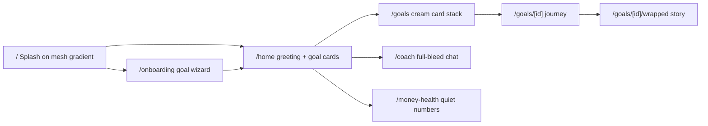

# Nuture Savings Timeline: Goals, Visualiser and Proactive Coach

## 1. Summary

The current MVP, branded NextPound, answers "What should I do with my next £?" for an older, debt/mortgage-heavy audience (`/` onboarding, `/plan` ladder dashboard, Grok chat with calculator tools, all in `localStorage`). This plan **renames the app to Nuture** and pivots the **home experience** to a goals-first **Savings Timeline** for younger, less financially literate savers. Nuture is a personal-growth coach, not a productivity tool and not a metrics dashboard: a warm, intelligent companion that helps you set, track and reach plans. The existing ladder dashboard moves to a quiet **Money health** screen, off the main nav.

**Prerequisite:** the MVP source lives on branch `cursor/cursorandeffect-mvp`. `main` only contains the initial commit (a one-line README). Implementation must start from the MVP branch, either by creating a feature branch off it or by merging it into `main` first.

Core promise: *"Hey Jordyn. What can I help with today."* Progress feels close and visible. The future plan feels like "me". Small actions hit clear checkpoints. Spending is framed as delaying a named plan, not as failure. Money moves on autopilot.

Hackathon constraints:

- All accounts, transactions and email/social signals are mocked, with seeded fixtures plus a demo-controls drawer.
- Every number comes from pure, tested engine functions. Grok only explains and coaches, the same rule as today in [lib/ai/systemPrompt.ts](lib/ai/systemPrompt.ts).
- No DB and no auth. State stays in `localStorage`.
- Before writing route code, read the relevant guides in `node_modules/next/dist/docs/` (Next 16.3: async `params`, the `PageProps`/`LayoutProps` helpers, and `redirects` in `next.config.ts`), as required by [AGENTS.md](AGENTS.md).

## 2. Customer and problem

**Who:**

- Early-career people on lower incomes with little disposable income
- People planning to start a family
- People with near-term aspirations (trips, gigs, a car) as well as long-term ones (a home, family)
- People who are not financially literate and don't see the value of long-term saving

**Problem:**

- The only goals on offer (house deposit, retirement) feel unreachable, so "save more" has no meaning.
- Without visible near-term wins, people delay saving. That leads to missed goals and reliance on credit.
- Big spends (a big night out) aren't connected to what they displace, and nobody helps recover from them.

**Stance:** "Pause and choose", never "you're failing". The tone should be positive, recoverable and human.

## 3. Behavioural principles and the features that apply them

- **Goal gradient** (Kivetz 2006): the headline is *distance left* ("£640 · 41 days to Bali"), not £ saved.
- **Vivid progress near the end** (Cheema & Bagchi 2011): the visual intensity of the timeline scales with progress. Below 25%, show small-win checkpoints. From 25% to 75%, use the standard view. Above 75%, enlarge the plan photo and show a countdown and a glow.
- **Future-self continuity** (Hershfield): every goal has a photo, a date, a "why it matters" line and "Future you on 4 Sep 2027, aged 25".
- **Checkpoints as reference points** (Colby & Chapman 2013): checkpoints sit on exact multiples of the auto-save, so one realistic deposit hits a checkpoint exactly.
- **Opportunity cost made explicit** (Frederick 2009): every spend alert and the simulator show "+N days to [goal name]".
- **Earmarking and commitment** (Thaler; CFPB/Qapital 2022): each goal is a named pot. Payday auto-save is on by default and shown as the green baseline. Round-ups are an optional top-up.

## 4. Information architecture



Bottom nav is exactly three items, in this order: **Goals** (target circle), **Home** (house outline), **Coach** (four-pointed star). Money health is reached from the profile icon, not the nav.

- `/` ([app/page.tsx](app/page.tsx)): splash on the mesh gradient. Wordmark first, then a loading pill, then the demo personas and a "Plan a new goal" pill. If state already exists, continue to `/home`.
- `/onboarding` (new): the goals-based wizard (section 7.1), on the off-white surface with cream cards.
- `/home` (new): the coach home (section 7.2).
- `/goals` (new): the goal stack. The active card carries the signature gradient.
- `/goals/[id]` (new): the journey for one plan, divert simulator, replan, and photo. A client page using `useParams`.
- `/goals/[id]/wrapped` (new): milestone story slides on the mesh gradient.
- `/coach` (new): full-bleed coach conversation. The ✦ Assistant pill on Home opens the same screen.
- `/money-health`: the existing ladder from [app/plan/page.tsx](app/plan/page.tsx), restyled onto the off-white and cream system so it does not look like a second product. Add a `redirects()` entry `/plan -> /money-health` in [next.config.ts](next.config.ts). Its chat aside is removed because Coach is now its own screen.

## 5. Data model (new `lib/saver/schema.ts`, zod)

```ts
export const GoalSchema = z.object({
  id: z.string(), name: z.string().min(1).max(40),          // "Bali with Jess"
  category: z.enum(["trip","emergency","family","home","car","event","learning","other"]),
  horizon: z.enum(["short","medium","long"]),
  targetAmount: money, targetDate: isoDate, savedSoFar: money,
  potAccountId: z.string(), isPrimary: z.boolean(),
  image: z.string().optional(), whyItMatters: z.string().max(140).optional(),
  autoSave: z.object({ amount: money, cadence: z.enum(["weekly","payday"]), enabled: z.boolean() }),
  roundUps: z.boolean(), checkpointsCelebrated: z.array(z.number()),
});
export const AccountSchema = z.object({ id, provider, name, balance: money, aer: percent.optional(),
  kind: z.enum(["current","easy_access","cash_isa","lisa","stocks_isa","pension"]), connected: z.boolean() });
export const TransactionSchema = z.object({ id, accountId, date: isoDate, merchant, amount: z.number(),
  category: z.enum(["income","bills","groceries","transport","eating_out","nights_out","shopping",
                    "subscriptions","goal_transfer","other"]), recurring: z.boolean() });
export const SaverStateSchema = z.object({
  version: z.literal(2), today: isoDate,            // simulated clock for demo controls
  profile: ProfileSchema,                           // reused so Money health + existing tools keep working
  goals: z.array(GoalSchema).max(6), accounts, transactions, preferences, coachEvents,
});
```

- `preferences`: interests, life stage, payday day, alert threshold in days, coach tone, and connection flags `{ bank, email, social }`.
- `coachEvents`: `{ id, kind, severity, goalId, amount, deltaDays, status: "new" | "kept" | "spent" | "moved" | "dismissed", createdAt }`. These drive the feed, the badge and the frequency cap.
- `lib/saver/use-saver-state.ts`: the same `useSyncExternalStore` pattern as [lib/use-profile.ts](lib/use-profile.ts), with key `nuture.state.v2` and change event `nuture-state-change`. On first load it migrates any legacy `nextpound.profile.v1` by wrapping it with a default emergency-fund goal, then removes the old key.
- `lib/saver/derive-profile.ts`: keeps `profile.cashSavings`, `idleCurrentAccountCash` and the ISA fields in sync from `accounts`, so [lib/finance/ladder.ts](lib/finance/ladder.ts) and the existing tools work unchanged.
- Fixtures go in `data/saver-personas.ts` and `data/mock-transactions.ts` (a seeded generator with 90 days of realistic UK spending):
  - **Jordyn, 24**, junior marketing exec, £2,100 net a month. Goals: Bali £1,800 (primary), Emergency fund £1,000, First home with a Lifetime ISA (long-term). Typology: Social Connector. The home greeting is "Hey Jordyn".
  - **Jordan and Taylor, 29 and 31**, planning a baby in about 2 years. Goals: Baby's first year £6,000 (primary), Parental leave top-up, Car upgrade.
  - The existing Sam, Priya and Mark personas load with an auto-generated goal set, so Money health still demos.

## 6. Engines (pure functions with vitest tests, under `lib/`)

- `lib/timeline/eta.ts`
  - `projectGoal(goal, { today, topUps })` returns `{ etaDate, daysLeft, amountLeft, dailyRate, series }`, where `dailyRate = autoSave per month * 12 / 365 + average top-ups`.
  - `divertImpact(goal, amount, { today })` returns `{ onTrackEta, divertedEta, deltaDays = ceil(amount / dailyRate) }`.
  - `replan(goal, { keepDate | keepAmount })` returns a new weekly amount or a new date.
- `lib/timeline/checkpoints.ts`
  - `buildCheckpoints(goal)` returns the next 3 or 4 **step** checkpoints at `saved + k * autoSave` (each hit exactly by one deposit, the first within 7 days), then **milestones** at 25, 50, 75 and 90%, snapped to the nearest exact deposit multiple, then **finish**.
- `lib/timeline/budget.ts`
  - `payCycleStack(state)` returns `{ income, committed (bills + auto-saves + debt minimums), spent (discretionary since payday), leftForGoals }`.
- `lib/coach/rules.ts`
  - `evaluateCoach(state)` returns new `CoachEvent[]` (rules in sections 7.4 to 7.6). It caps slip notes at one per day, and only raises one if `deltaDays >= max(alertThresholdDays, 2% of daysLeft)` on the primary goal.
- `lib/coach/typology.ts`
  - `classifyTypology(transactions)` returns a positively framed profile: Social Connector, Experience Seeker, Steady Builder, Subscription Curator or Weekend Warrior. Each comes with a strength and a "your saving superpower" line.
- `lib/coach/copy.ts`
  - Template copy for every alert state. A test enforces banned words ("failed", "bad", "impulsive", "regret", "don't", "should have", "streak", "points", "due date", "great work").
- `lib/milestones/wrapped.ts`
  - `buildWrapped(state, goalId, checkpoint)` returns slides covering: amount already waiting, days pulled forward, best skipped spend, the Friday save in a sentence (no streak count), a future-you line, and What's next.

## 7. Features

### 7.1 Goals-based onboarding (`/onboarding`, `components/onboarding/goal-wizard.tsx`)

The wizard has six steps, each skippable, with progress dots.

1. **About you**: name, age, life stage (studying, early career, settling down, planning a family) and payday.
2. **Your next few years**: pick from illustrated goal templates. Quick wins (trip, gig, gadget) and life goals (emergency fund, baby, home, car) are shown side by side. Capped at **3 active goals**; the rest go to a "Later" list. Goal details are a target and date (with suggested amounts), a photo and "why it matters".
3. **Bring your money together**: a mocked Open Banking modal with fictional providers. Connecting reveals current, savings, ISA, investment and pension accounts.
4. **Your spending**: a short sentence per category from the mocked transactions, not a chart, then the typology ("You're a Social Connector. Your money goes on people. Let's make that work for Bali.").
5. **Lifestyle signals (optional)**: mocked email and social connections with clear consent copy. A "Bali flight price alert" email suggests a trip goal, and social interests set lifestyle tags. Labelled as simulated.
6. **Your plan**: choose the primary goal, then set the auto-save (default on, pre-filled with an amount that fits `leftForGoals`). Round-ups are an optional toggle. The step ends with a preview of the first checkpoint ("£45 this Friday gets you to checkpoint 1").

"Help me build my goals" opens `/coach`. A `propose_goal` tool returns a cream draft card with a **Plan this goal** pill.

### 7.2 Home (`/home`)

A coach screen, not a dashboard. Full-bleed mesh gradient. Content is present on load, not revealed on scroll.

- **Top bar**: ✦ Assistant pill, top left (frosted, white border, opens `/coach`). Circular profile icon, top right, same frosted treatment (opens Money health and account connections).
- **Headline**: "Hey Jordyn" then "What can I help with today", Inknut Antiqua ~40px, white, centred, line-height 1.15. No question mark: it is an invitation.
- **One primary plan**: a single journey (section 7.3) under the greeting. Secondary goals do not compete here; they live on `/goals`.
- **Coach notes**: up to 3 cream cards (a spend choice, leftover money, idle cash, or a replan), stacked with a 16px gap. Amounts are written as sentences ("£212 is still yours until payday"), never as KPI tiles.
- **Action**: a frosted pill, "Plan a new goal".

### 7.3 Savings timeline visualiser (`components/timeline/`)

A journey, not a chart. No axes, gridlines, or percentage badges. The maths in section 6 still drives every date and amount; the screen just speaks it.

- `primary-timeline.tsx`: a horizontal path of rounded nodes from today to the plan. The on-track path is lime. When a divert is active, a second path in acid yellow shows the later arrival, labelled in a sentence ("12 Sep if you spend £46 today"). The payday auto-save is the path itself; round-ups are smaller nodes along it. Built with SVG, not Recharts. Recharts stays on Money health only.
- `eta-chip.tsx`: plan photo, the plan's name in DM Sans Medium, and the arrival as a story ("Future you, 4 Sep"). Distance left is a sentence ("£640 still to go"), not a stat.
- `checkpoint-ladder.tsx`: the next few nodes, each one exactly one realistic save away. A node eases toward acid yellow over ~300ms when a pending choice affects it. The pulse is off under `prefers-reduced-motion`.
- `divert-simulator.tsx`: a pill row (coffee £3.40, takeaway £18, night out £46) rather than a clinical slider-first control. It shows "+N days" live and a "Put it toward [goal name]" pill.
- **Progress stages**: below 25%, the next small node is the focus. From 25% to 75%, the path is the focus. Above 75%, the photo grows and the line becomes "Bali is close. 4 Sep." No countdown chrome, no points.

### 7.4 Spending coach: decision-moment alerts (`components/coach/decision-alert.tsx`)

Each alert follows the same recipe: concrete cost first, the goal named (not the person's character), one mild worry cue, both sides shown, always an exit, and a frequency cap.

Alert states, in the brand palette. Colour is never the only signal, and red banners are not used.

- **Protect**: a cream card. "£28 is spare this week. Move it to Bali and you land 2 days earlier."
- **Small dip**: a cream card, no interruption, for a delay of 3 to 7 days.
- **Big dip**: the active goal card eases from cream to the signature gradient (~300ms) and the affected node shifts to acid yellow. Used above 7 days, or above 10% of the time left.
- **Emergency**: near-black text on cream, only when the spend would drop the current account below essentials before payday, or would need the emergency fund or overdraft. Offers "Pause until payday", and the existing debt-advice signposts if it repeats. No siren, no full-screen block.

Card layout: the consequence number at the top centre, one line of copy, and CTAs at the bottom:

> **Bali · −8 days**
> That £46 puts your trip on **12 Sep** instead of **4 Sep**.
> [Keep plan] [Spend anyway] [Put £20 to Bali] [Adjust plan]

After a big spend, the coach offers a positive bounce-back plan: "Worth it! Here's how to win it back by Sunday: a cook-in Saturday (£15) and skipping one Uber (£9) puts Bali back on 4 Sep." The swaps come from the user's own top categories.

### 7.5 Utilisation coach

- **Idle cash**: when the current account is above the buffer plus a month of essentials, suggest moving the excess to the goal pot at the best easy-access AER. This reuses `bestProduct` and `idleCurrentAccountCash` from [lib/finance/savings.ts](lib/finance/savings.ts).
- **Unused allowances**: for long-term goals, flag ISA or Lifetime ISA room (reusing `isaRoom`, `lisaRoom` and `lisaEligibility`), e.g. "The 25% Lifetime ISA bonus on your home goal = +£250 free".
- **Spread assets**: a simple map from each account to the goal it serves, flagging money that isn't working (0% savings, or cash sitting next to a high-APR debt). Linked to Money health.

### 7.6 Auto-replan after a miss (`replan-card.tsx`)

When a payday auto-save fails or is skipped, nothing is framed as a broken streak, a score, or a failure. The card offers a replan in one tap: "Friday's save didn't go through. £52 a week for 3 weeks keeps Bali on 4 Sep, or we move it to 18 Sep."

### 7.7 Coach screen and the milestone check

- `/coach` is a full-bleed mesh screen, not a side sheet. Headline: "Hey Jordyn" / "What can I help with today", with the ✦ above it. The same screen opens from the Coach nav item and the Home Assistant pill.
- `components/shell/coach-provider.tsx` (client context in the layout) owns `useChat`, so the conversation survives navigation. Alert cards call `openCoach(prefill?)` for "Talk it through".
- The transcript reuses [components/chat/chat-panel.tsx](components/chat/chat-panel.tsx), restyled: white text on the gradient, frosted pills for suggestions, DM Sans. A "For you" row above the composer shows the latest coach note.
- **Proactive without cost**: new coach events are inserted as templated messages from `lib/coach/copy.ts`, with no LLM call. Follow-ups go to Grok.
- **Milestone check**: a suggestion pill, "How am I doing", calls `milestone_check`. The reply is a friend, not a report: one thing going well, one focus, the next node. No "you've completed N goals".

### 7.8 Spotify Wrapped-style milestones (`/goals/[id]/wrapped`, `components/wrapped/wrapped-story.tsx`)

- Full-screen, tap-to-advance slides on the mesh-gradient asset (background-size: cover). Type is Inknut Antiqua in white. Built with CSS transitions from `tw-animate-css`. Each story ends with a frosted share pill.
- They trigger when a milestone node (25, 50, 75, 90 or 100%) is first crossed and recorded in `checkpointsCelebrated`.
- Example slides, written as a friend: "£450 is already waiting for Bali", "You pulled the trip 6 days closer", "Skipping Friday's takeaway gave you 2 days back", "Your Friday save has been looking after this", "Future you lands in Bali on 4 Sep". No points, no streak count.
- The plan name stays pinned so the main goal does not disappear. The last slide is always **What's next**: the next node and a "Put £20 toward Bali" pill.

### 7.9 Money health tab (`/money-health`)

This is the existing ladder, debt and mortgage view, restyled onto off-white with cream cards and DM Sans. Charts live only here, and they use the lime, acid yellow and near-black tokens rather than the old teal palette. A line of copy links back: "Your emergency fund step is feeding your Emergency fund plan." The chat aside is removed because Coach is `/coach`.

## 8. AI changes

- [app/api/chat/route.ts](app/api/chat/route.ts): the request body changes to `{ messages, state }`, validated with `SaverStateSchema`. The `Profile` is derived for the existing tools.
- [lib/ai/tools.ts](lib/ai/tools.ts): keep the 5 existing tools and add these, all closed over the state:
  - `get_goal_status(goalId?)`: distance left, ETA and next checkpoint.
  - `simulate_spend(amount, goalId?)`: dual ETA and delta in days.
  - `suggest_swaps(category?)`: personalised swaps from the user's transactions.
  - `find_idle_money()`: utilisation findings.
  - `replan_goal(goalId, keep: "date" | "amount")`.
  - `milestone_check()`: wins, focus and next checkpoint.
  - `propose_goal(category, name?, targetAmount?, targetDate?)`: a draft goal, which the UI can add.
- [components/chat/tool-cards.tsx](components/chat/tool-cards.tsx): add cards for each new tool, reusing the `eta-chip`, mini timeline and `decision-alert` components.
- [lib/ai/systemPrompt.ts](lib/ai/systemPrompt.ts): change the opening line from "You are NextPound, a friendly, plain-English UK money guide" to "You are Nuture, a warm UK savings coach", then add a voice section drawn from section 9:
  - A knowledgeable friend. Warm, not saccharine. "You're doing really well" rather than "You've completed 3 goals, great work."
  - Use the person's name. Prompts are invitations without a trailing quiz tone.
  - Actions are concrete: "Plan a new goal", "Put £20 toward Bali". Never "Add goal" or "Get started".
  - Coach, not parent: lead with the concrete cost in days for a named plan, never judge character, always offer a way out.
  - No streaks, points, due dates, or all-caps. 2 to 4 sentences.
  - The facts JSON is a compact summary (goals with arrivals, account totals, top 5 categories over the last 30 days, typology), not raw transactions.
  - Keep the existing guardrails (debt signposting, Samaritans, no investment picks).

## 9. Brand

Nuture is a personal-growth and goal-coaching app: a warm, intelligent companion. It is not a productivity tool, a task manager, or a clinical dashboard.

### What it is not

- Not a task manager. No due-date badges, streaks, or points anywhere in the UI. Arrivals are spoken as a story ("Future you, 4 Sep"), and the date still drives the engine.
- Not clinical. Home, Goals, Coach and Wrapped have no charts and do not lead with metrics. Recharts is confined to Money health.
- Not loud. Lime is confident. Slips use cream and acid yellow, not red banners.
- Not generic. The serif against DM Sans, and the grain in the mesh, stay. Do not flatten them into the old teal shadcn theme.

### Colour

Replace the teal tokens in [app/globals.css](app/globals.css) and register them in `@theme inline`.

- Lime `#5CD719`: primary. Hero fields, the active goal card, primary pills.
- Acid yellow `#C8E000`: gradient terminus, the "if you divert" path, the mild slip cue.
- Warm cream `#EDE8E0`: goal cards and coach notes.
- Off-white `#F7F5F2`: page background, so cream cards have a surface.
- Near-black `#1A1A1A`: text on light surfaces. Active nav.
- White `#FFFFFF`: text and icons on green.
- Inactive nav: a medium grey, around `#8A8680`.

### Mesh gradient

`public/brand/image-mesh-gradient.png` is a supplied asset, used as `background-size: cover` on every full-green screen: splash, Home, Coach, Wrapped, and the active goal card's large state.

- The field is acid yellow (~`#D4E600`) out to the edges. A soft green mass (~`#4CC415` at the core, feathering to ~`#7ED321`) sits slightly left of centre, like a watercolour ovoid, not a radial gradient.
- Fine grain is baked in. Do not blur it, overlay a flat colour, or rebuild it with CSS gradients.
- On the Goals screen, the active card may use a simpler `linear-gradient` from lime to acid yellow, because it is small. Every full-bleed green screen uses the asset.

### Typography

Load both with `next/font/google`, replacing Geist.

- **Inknut Antiqua**, regular to medium: wordmark, hero headlines, section titles ("Goals").
- **DM Sans**, regular to medium: card titles, body, labels, nav.

Scale: wordmark ~56px serif white; hero ~40px serif white, centred, line-height 1.15; section title ~32px serif near-black; card title ~22px DM Sans medium; card body ~15px DM Sans at 60% opacity; nav labels ~13px DM Sans, sentence case. Never all-caps.

### Iconography

Line icons, slightly rounded. Nav: Goals is a target circle, Home is a house outline, Coach is a four-pointed star. The star also sits above the splash heading and inside the Assistant pill. It means intelligence.

### Components

- **Goal cards**: cream, ~20px radius, ~24px padding, no shadow, stacked with ~16px gap. The active card eases to the gradient with white text over ~300ms.
- **Pills**: fully rounded. On green, white text on ~20% white fill (frosted). DM Sans ~17px. Label "Plan a new goal", not "Add goal" or "Get started".
- **Nav**: white, full width, ~80px, fixed to the bottom. Icon above label, three items centred. Active is near-black, inactive is grey. No border and no divider.
- **Assistant pill**: top left on Home, frosted, "✦ Assistant".
- **Profile**: top right on Home, circular, frosted.

### Motion

Splash: the mesh fades in, the wordmark appears, then the loading pill pulses in opacity. Card selection eases over ~300ms. No scroll-driven reveals.

### Voice

Warm but not sweet. Personal and direct ("Hey Jordyn"). Invitations, not quizzes ("What can I help with today"). Clear actions. The banned-words test in `lib/coach/copy.ts` also rejects streak, points, due date, and "great work".

### Rebrand checklist

- [app/layout.tsx](app/layout.tsx): title "Nuture", description about a savings coach, bottom nav, footer in near-black on off-white. Drop the pound-sign logo; the wordmark is the serif name plus the star.
- [app/page.tsx](app/page.tsx): splash, not the old four-tile pitch.
- [components/chat/chat-panel.tsx](components/chat/chat-panel.tsx): restyle onto the mesh; drop the "Money guide" header.
- [README.md](README.md): name, positioning, demo script, diagram.
- Storage keys move to `nuture.*` (section 5).
- After the rename, a search for `NextPound|nextpound` outside `node_modules` and `.next` returns only the legacy key constant.
- Goal art: 8 to 10 illustrations in `public/goals/*.webp`. A user photo is resized under 200KB and stored as a data URL.
- shadcn adds: `dialog`, `slider`, `select`, `tooltip`, `radio-group`, `checkbox`. No sheet: Coach is a route.

## 10. Demo mode and script

`components/demo/demo-controls.tsx` is a floating drawer (`?demo=1`) with these actions:

- Big night out £46
- Coffee £3.40
- Payday
- Skip an auto-save
- Fast-forward 1 week
- Jump to 75%
- Idle £600 lands in the current account

Each action changes the simulated state and `today`, and `evaluateCoach` reacts.

Demo script (about 5 minutes):

1. Splash: wordmark, then the loading pill, then start the wizard as Jordyn. Pick Bali, Emergency fund and First home, connect the mock bank, see the typology in a sentence.
2. Home opens on the mesh: "Hey Jordyn / What can I help with today", with Bali as the only journey. The next node is exactly Friday's £45.
3. Trigger "Big night out £46". The Bali card eases to the gradient and a node shifts to acid yellow. "That £46 puts Bali on 12 Sep instead of 4 Sep." Tap "Put £20 toward Bali" and the arrival updates.
4. Trigger "Idle £600". A cream card offers to move it into the pot.
5. Tap ✦ Assistant and ask "How am I doing". The reply is a short, human note.
6. Trigger "Jump to 75%". Wrapped plays on the mesh and ends on What's next.
7. Open Money health from the profile icon to show the ladder engine, restyled, behind the coach.

## 11. Build phases (in order; phases 1 to 3 are the must-have demo slice)

- **Phase 0, foundations**: the brand system and rebrand checklist (section 9), including fonts, tokens and the mesh asset, schemas, state hook with migration, derive-profile, the Jordyn persona and seeded transactions, shadcn adds, bottom nav and `CoachProvider`, move `/plan` to `/money-health` with a redirect.
- **Phase 1, timeline core**: `eta`, `checkpoints` and `budget` engines with tests. Then `/home` as a mesh greeting with one SVG journey, `/goals` as a cream card stack, and `/goals/[id]` with the divert pills.
- **Phase 2, proactive coach**: `rules`, `copy` (with the banned-words test) and `typology`. Coach feed, decision-alert states, utilisation card, replan card and demo controls.
- **Phase 3, Coach screen**: `/coach` on the mesh, provider refactor of `ChatPanel`, new tools and tool cards, and the voice section of the system prompt.
- **Phase 4, onboarding**: the goal wizard, mocked bank/email/social connections, typology reveal and `propose_goal`.
- **Phase 5, Wrapped**: the wrapped engine and story slides, with milestone triggering.
- **Phase 6, polish**: landing copy, goal art, README demo script and the new architecture diagram, `npm run lint` and `npm test` passing.

If time runs short, cut from the end: email/social signals first, then Wrapped sharing, then the `propose_goal` flow.

## 12. "Avoid" list enforced in code

- Flat early progress: the first step checkpoint is always within 7 days (asserted in the checkpoints test).
- Too many goals at once: at most 3 active goals and a single primary hero.
- Streaks, points and due-date chrome: a miss offers a replan in a sentence. A copy test rejects "streak", "points" and "due date".
- Over-celebrating a subgoal: the plan name stays pinned during Wrapped, which always ends on What's next.
- A metrics-first home: the headline is the serif greeting. Amounts live in sentences on cream cards.
- Nagging: the frequency cap and threshold in `evaluateCoach` are covered by tests.
- A rebuilt mesh: full-green screens use `image-mesh-gradient.png` with `background-size: cover`. No CSS-gradient substitute, and no extra blur over the grain.

## 13. Testing

- Vitest unit tests for each engine: ETA maths, exact-hit checkpoints, the pay-cycle stack, coach thresholds and frequency cap, typology classification, wrapped slides and the banned-words copy lint.
- Extend [lib/ai/tools.test.ts](lib/ai/tools.test.ts) with mock-model coverage of the new tools.
- Manually run through the demo script on both personas, with and without `XAI_API_KEY`. Everything except free-text chat must work without the key.

